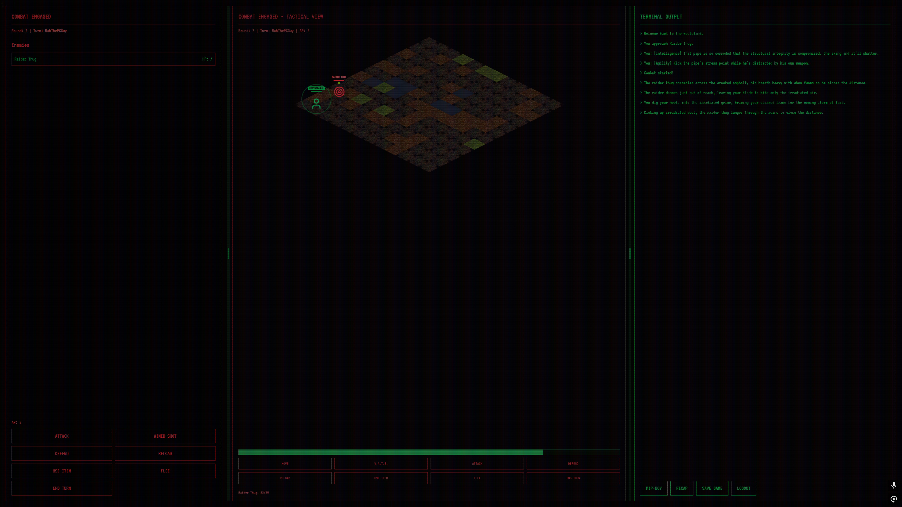
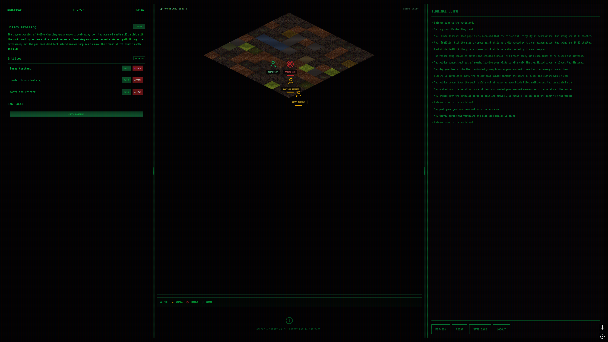
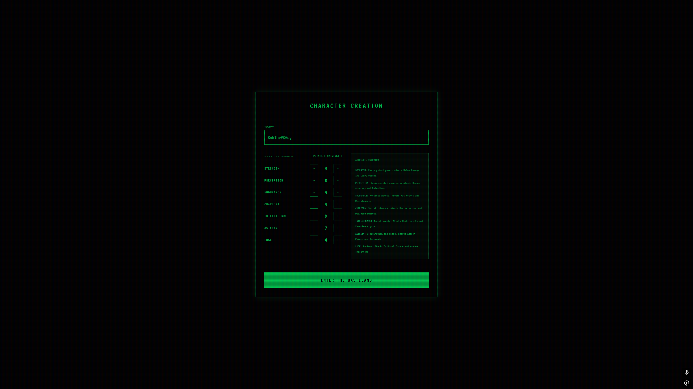
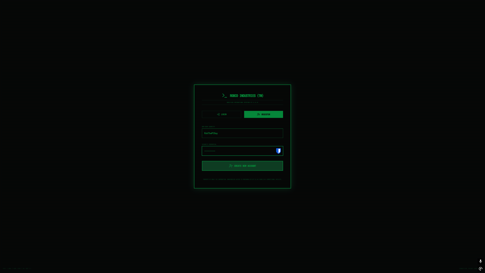

# Wasteland Engine

Most AI game projects dump LLM output straight into the world and hope for the best. Wasteland Engine doesn't do that.

It's a Fallout-style browser RPG built around a five-stage AI content generation pipeline. Every piece of generated content gets validated, repaired if needed, and deterministically realized before it touches game state. Nothing the LLM produces enters the world unchecked. The pipeline is the interesting part here, not the game itself. If you're looking at this repo, look at `server/generation/`.

<p align="center">
  
  
</p>
<p align="center">
  
  
</p>


https://github.com/user-attachments/assets/429cfea7-5e4c-404f-b6a7-6618d59fe9d9


## How the Pipeline Works

Raw LLM output goes through five stages. Each one exists because something specific goes wrong without it.

### 1. Spec Creation

`server/generation/specStore.ts`

The pipeline asks Gemini to generate a `LocationSpec`, a structured JSON description of a location: name, biome, NPCs, items, encounter parameters. Every spec gets a `stable_id` for deduplication and `run_id`/`trace_id` columns for provenance.

What matters here is that the AI describes what it wants to create, and that description gets stored, tracked, and validated before anything happens. Raw LLM output never writes directly to game state. Most projects skip this step, and that's where things start breaking.

### 2. Admission Gating

`server/generation/admission.ts`

Every spec faces admission. Validation rules in `server/validators/worldRules.ts` check biome consistency, name uniqueness, banned motifs, and structural requirements. Three possible outcomes: **admit**, **repair_needed**, or **reject**.

This is the firewall. Without it, a single hallucinated location name propagates into quests, NPC dialogue, and travel routes before anyone notices. The admission gate decides what's canon, not the LLM.

### 3. Auto-Repair

`server/generation/repair.ts`

When admission says `repair_needed`, this stage tries to fix the spec automatically. It normalizes biome tags, strips banned motifs, fixes structural issues.

The constraint that matters: repair is a **pure function**. It takes a spec and a validation report, returns a repaired spec, and has zero database access. No side effects, no accidental state mutations, fully testable without mocking anything. If the repair works, the spec re-enters admission. If it doesn't, the spec gets rejected.

### 4. Deterministic Realization

`server/generation/realizer.ts`

Admitted specs describe what should exist. The realizer turns those descriptions into concrete game entities (NPCs with stats, loot tables, encounter parameters) using a **seeded PRNG** keyed on the spec's `stable_id`.

Same spec, same seed, same output. That makes the whole pipeline reproducible. If a location is broken, you regenerate it from its spec and get the exact same result, so you can actually figure out what went wrong.

Every realized entity carries provenance: `run_id`, `trace_id`, `realization_id`, `realization_version`. You can trace any NPC, any item, any encounter back to the generation run that created it.

### 5. Canon Policy

`server/world/canonPolicy.ts`, `server/world/types.ts`

Generated content enters as `runtime` canon. It can be promoted to `session` canon (persists within a play session), then to `persistent` canon (permanent world state). The context builder (`contextBuilder.ts`) assembles world history for AI prompts so the LLM sees a coherent world when generating new content, not a pile of disconnected outputs.

## The Feature Flags

Six flags in `server/world/featureFlags.ts` trace the migration path from legacy seed data to fully AI-generated content. All default to `false`. They're dormant on purpose, not because someone forgot to flip them. They document how the pipeline was designed to evolve.

The sequence matters because each flag gates the next.

**`structured_generation`** turns on typed, validatable `LocationSpec` output instead of loose prose. **`shadow_generation`** runs the new pipeline alongside legacy outputs so you can compare without risk. **`canon_promotion`** lets validated content graduate from runtime to persistent canon automatically. **`asset_activation`** makes the game start consuming pipeline-generated content instead of seed data. **`strict_travel_authority`** enforces server-issued `request_id` tokens for travel, so the client can't move to unvalidated locations. **`world_inspection`** opens debug endpoints for inspecting world state, canon levels, and generation history.

You wouldn't enable `canon_promotion` before `structured_generation` is stable, and you wouldn't enable `asset_activation` before canon promotion is producing reliable results. The flags encode that discipline.

## The Game

The RPG exists to give the pipeline something real to generate for. It's not a finished game, but it's not a toy either.

Combat is turn-based on an isometric grid with A* pathfinding, limb-targeted damage, action points, and NPC AI that makes flee/heal/attack/cover decisions based on health and distance (`server/combat.ts`, `server/combat-services/`). Exploration uses isometric tile maps with scavenging, terminal hacking, and NPC interaction (`src/components/IsometricExplorationView.tsx`). Trading is location-bound with generated inventories (`server/routes/trade.ts`). Quests track progress across talk/fetch/kill objectives (`server/quests.ts`). Maps are procedurally generated across 7 biome configurations with seeded RNG (`server/mapgen.ts`).

Frontend is React 19 with Tailwind. Backend is Express and SQLite via better-sqlite3. Single process, no deployment complexity.

## What Doesn't Work

Karma exists as a database column. Nothing reads or writes it. It was planned but never built.

RadAway is seeded with a `rad_heal` effect that no code processes. Using it eats the item and does nothing.

Random encounters are cosmetic. The choices add narrative text but don't touch game state.

The `world_deltas` table is referenced in `worldService.ts` but never created. It's scaffolding for a feature behind the dormant flags.

There's no production static serving. No `express.static()` fallback. Run it with `npm run dev`.

The Gemini API key gets injected into the browser bundle by Vite's `define`. Fine for local use. **Do not deploy this publicly.**

All feature flags are off. The structured generation pipeline is dormant. The game runs entirely on legacy seed data. The pipeline code is the reference implementation, and actually enabling it requires work this repo doesn't provide.

## Setup

```bash
git clone <repo-url>
cd wasteland-engine
npm install
```

Create a `.env` file (see `.env.example`):

```
GEMINI_API_KEY=your-api-key-here
```

You'll need a [Google AI Studio](https://aistudio.google.com/) API key with access to `gemini-3-flash-preview`.

```bash
npm run dev
```

Open `http://localhost:3000`.

**SQLite note:** This project uses better-sqlite3 v12.6.2, which bundles SQLite 3.51.2. That's above the 3.50.2 threshold for CVE-2025-6965, so the vulnerability doesn't apply here.

**Other commands:**
`npm run build` produces a frontend build (no static serving configured). `npm run lint` runs TypeScript type checking. `npm run test` runs the test suite.
